# Claude Code 实战指南：从入门到精通

## 变更记录 (Changelog)

### v1.2.0 (2026-03-04)

**增量更新 - 发现5个新建章节**
- 发现第02章已创建：`第02章：30+命令与快捷键，编程效率直接翻倍.md`（约40+内容，已完成）
- 发现第03章已创建：`第03章：告别重复提示词，自定义Commands让AI秒懂你.md`（约50+内容，已完成）
- 发现第04章已创建：`第04章：让Claude连上一切——MCP与Hooks实战.md`（约50+内容，已完成）
- 发现第05章已创建：`第05章：Skills定制——给Claude装上专属能力包.md`（约50+内容，已完成）
- 确认项目共有 5 个章节已完成（第01-05章），第06-09章待建
- 发现 `assets/` 目录含 48 张教程配图（增加至 48 张）
- 更新章节状态：基础篇（3章）+ 进阶篇（2章已完成，3章待建）
- 更新模块结构图（Mermaid），补充第02-05章章节信息
- 更新教程章节概览表，反映真实的章节完成度

**扫描覆盖率**：
- 已扫描：18 个文档文件（Markdown + JSON）
- 总文件：72 个（含图片 48 张）
- 有效文档覆盖率：100%

**扫描时间**：2026-03-04 15:46:45

---

### v1.1.0 (2026-02-28)

**增量更新**
- 发现主教程索引文件已新增：`Claude Code 实战指南：从入门到精通，凯神带你忘本其他AI.md`（替代原 ccfx.md）
- 发现第一章独立文档：`第01章：快速上手与核心命令.md`（已完成）
- 确认章节结构：9 章规划，第1章完成，第2-9章为待建状态（标记 🚧）
- 发现 `assets/` 目录含 11 张教程配图
- 更新架构总览，反映真实目录结构
- 更新模块结构图（Mermaid），补充章节维度
- 更新模块索引，反映新增文件与状态
- 新增章节目录概览与学习路径说明
- 新增第01章核心内容摘要（ZCF、cc-switch、环境变量配置）
- 更新 API 中转站列表（同步最新渠道）

**扫描覆盖率**：
- 已扫描：13 个文档文件（Markdown + JSON）
- 总文件：24 个（含图片 11 张）
- 有效文档覆盖率：100%

**扫描时间**：2026-02-28 10:15:06

---

### v1.0.0 (2026-02-26)

**初次创建**
- 创建根级 `CLAUDE.md`，记录项目全局结构与愿景
- 分析 6 个标准模板及自定义机制
- 建立模块索引与架构图
- 编写完整的使用指引与最佳实践
- 配置 AI 上下文索引 `.claude/index.json`

**模块覆盖率**：100%（8 个文件）

**扫描时间**：2026-02-26 10:47:07

---

## 项目愿景

本项目是一套完整的 Claude Code（Anthropic 的 AI 编程助手）**中文实战教程系列**，由凯神出品，内容全部免费。

**定位**：填补中文 Claude Code 系统性资料的空白，从零安装到企业实战全程覆盖。

**核心理念**：
- 做好指挥官，让 AI 为你工作
- 自然语言交互为中心，理解项目上下文
- 基础 + 进阶 + 实战三大模块，不同水平都能找到切入点

**内容规模**：
- 9 个完整章节，系统完整不断更（已完成 5 章，占 55.6%）
- 覆盖 Commands / MCP / Hooks / Skills / Plugins / Agent SDK 全部核心功能
- 配套工作流模板系统（`.spec-workflow/`）和 AI 上下文索引（`.claude/`）

---

## 架构总览

本项目采用**混合文档模式**，整合了：

1. **教程主索引**：`Claude Code 实战指南：从入门到精通，凯神带你忘本其他AI.md` - 9 章全局目录与三条学习路径
2. **章节文档**：`第0X章：*.md` - 各章节独立教程（第1-5章已完成，第6-9章待建）
3. **媒体资源**：`assets/` - 教程配图（48 张 PNG）
4. **工作流框架**：`.spec-workflow/` - 标准化项目规范模板系统（6 个模板 + 自定义机制）
5. **上下文管理**：`.claude/` - AI 上下文索引和权限配置

```
cc/
├── Claude Code 实战指南：从入门到精通，凯神带你忘本其他AI.md  # 主教程索引（9章目录）
├── 第01章：从零到起飞，10分钟让AI为你写代码.md                # 第一章（已完成）
├── 第02章：30+命令与快捷键，编程效率直接翻倍.md                # 第二章（已完成）
├── 第03章：告别重复提示词，自定义Commands让AI秒懂你.md         # 第三章（已完成）
├── 第04章：让Claude连上一切——MCP与Hooks实战.md               # 第四章（已完成）
├── 第05章：Skills定制——给Claude装上专属能力包.md              # 第五章（已完成）
├── 第06章：Plugins生态完整指南 *.md                           # 待建 🚧
├── 第07章：Claude Agent SDK完整指南 *.md                      # 待建 🚧
├── 第08章：CLAUDE.md与多模态完整指南 *.md                     # 待建 🚧
├── 第09章：企业实战完整指南 *.md                              # 待建 🚧
├── CLAUDE.md                                                  # AI 上下文（本文件）
├── assets/                                                    # 教程配图（48 张）
├── .spec-workflow/                                            # 规范工作流系统
│   ├── CLAUDE.md                                              # 模块文档
│   ├── templates/                                             # 默认模板库（6 个）
│   │   ├── requirements-template.md
│   │   ├── design-template.md
│   │   ├── tasks-template.md
│   │   ├── product-template.md
│   │   ├── tech-template.md
│   │   └── structure-template.md
│   └── user-templates/                                        # 自定义模板覆盖目录
│       └── README.md
└── .claude/                                                   # AI 上下文目录
    ├── index.json                                             # 扫描索引和元数据
    └── settings.local.json                                    # 本地权限配置
```

---

## 模块结构图

```mermaid
graph TD
    Root["(根) Claude Code 实战指南<br/>凯神出品"] --> Index["主教程索引<br/>Claude Code 实战指南...AI.md"]
    Root --> Ch01["第01章：从零到起飞<br/>10分钟让AI为你写代码<br/>（已完成）"]
    Root --> Ch02["第02章：30+命令与快捷键<br/>编程效率直接翻倍<br/>（已完成）"]
    Root --> Ch03["第03章：自定义Commands<br/>让AI秒懂你<br/>（已完成）"]
    Root --> Ch04["第04章：MCP与Hooks实战<br/>让Claude连上一切<br/>（已完成）"]
    Root --> Ch05["第05章：Skills定制<br/>给Claude装上专属能力包<br/>（已完成）"]
    Root --> ChPending["第06-09章<br/>（待建）"]
    Root --> Assets["媒体资源<br/>assets/（48张配图）"]
    Root --> Workflow["规范工作流<br/>.spec-workflow/"]
    Root --> Context["AI上下文<br/>.claude/"]

    Index --> Path_A["路径A：快速上手（3小时）<br/>第1+2+3章"]
    Index --> Path_B["路径B：系统精通<br/>逐章推进"]
    Index --> Path_C["路径C：专项突破<br/>按需跳读"]

    Ch01 --> EnvSetup["环境准备<br/>Node.js / Git / API密钥"]
    Ch01 --> Install["安装方式<br/>官方脚本 / ZCF一键 / cc-switch"]
    Ch01 --> CmdRef["核心命令速查表"]

    Ch02 --> Commands["Slash命令全解析<br/>交互模式 / 快捷键大全"]

    Ch03 --> CustomCmd["自定义命令实战<br/>frontmatter / 参数处理"]

    Ch04 --> MCP["MCP服务接入<br/>GitHub/数据库/搜索等10+"]
    Ch04 --> Hooks["Hooks自动触发器<br/>格式化/测试/通知"]

    Ch05 --> Skills["自定义Skill编写<br/>结构 / SKILL.md / 脚本集成"]

    ChPending --> Ch06["第06章：Plugins生态"]
    ChPending --> Ch07["第07章：Agent SDK"]
    ChPending --> Ch08["第08章：CLAUDE.md多模态"]
    ChPending --> Ch09["第09章：企业实战"]

    Workflow --> Templates["模板库<br/>templates/（6个）"]
    Workflow --> UserTpl["自定义模板<br/>user-templates/"]

    Context --> IndexJson["扫描索引<br/>index.json"]
    Context --> Settings["权限配置<br/>settings.local.json"]

    click Ch01 "./第01章：从零到起飞，10分钟让AI为你写代码.md" "查看第一章"
    click Ch02 "./第02章：30+命令与快捷键，编程效率直接翻倍.md" "查看第二章"
    click Ch03 "./第03章：告别重复提示词，自定义Commands让AI秒懂你.md" "查看第三章"
    click Ch04 "./第04章：让Claude连上一切——MCP与Hooks实战.md" "查看第四章"
    click Ch05 "./第05章：Skills定制——给Claude装上专属能力包.md" "查看第五章"
    click Workflow "./.spec-workflow/CLAUDE.md" "查看工作流模块文档"
    click Templates "./.spec-workflow/templates/" "查看模板库"
    click UserTpl "./.spec-workflow/user-templates/README.md" "自定义模板指南"
```



---

## 模块索引

| 模块路径 | 职责 | 关键文件 | 状态 |
|---------|------|---------|------|
| 根目录 | 项目总体架构与 AI 上下文入口 | 主教程索引.md、CLAUDE.md | 活跃 |
| `第01章：从零到起飞...` | 环境准备、安装配置、API密钥、命令速查 | 独立 .md 文件 | 已完成 |
| `第02章：30+命令与快捷键...` | Slash 命令全解析、快捷键大全、最佳实践 | 独立 .md 文件 | 已完成 |
| `第03章：自定义Commands...` | 自定义命令开发进阶、frontmatter、参数处理 | 独立 .md 文件 | 已完成 |
| `第04章：MCP与Hooks实战...` | MCP 服务接入、Hooks 自动触发器、故障排查 | 独立 .md 文件 | 已完成 |
| `第05章：Skills定制...` | Skills 核心概念、自定义开发、脚本集成 | 独立 .md 文件 | 已完成 |
| `第06-09章（待建）` | 各专项深度教程 | 独立 .md 文件（待创建） | 待建 🚧 |
| `assets/` | 教程配图资源 | 48 张 PNG | 已有内容 |
| `.spec-workflow/templates/` | 标准化文档模板库（6 个） | requirements/design/tasks/product/tech/structure | 已完成 |
| `.spec-workflow/user-templates/` | 自定义模板覆盖机制 | README.md | 已完成 |
| `.claude/` | AI 上下文索引与权限管理 | index.json、settings.local.json | 活跃 |

---

## 教程章节概览

### 学习路径

| 路径 | 适合人群 | 章节组合 | 预计时长 | 状态 |
|------|---------|---------|---------|------|
| 路径 A：快速上手 | 完全零基础 | 第1章 + 第2章 + 第3章 | 3 小时 | 已完全可用 |
| 路径 B：系统精通 | 想彻底搞懂 Claude Code | 第1-9章逐章推进 | 完整学习 | 已5/9（56%） |
| 路径 C：专项突破 | 有基础、深入某功能 | 直接跳读目标章节 | 按需 | 可选第1-5章 |

### 章节状态

| 章节 | 标题 | 状态 | 核心主题 |
|------|------|------|---------|
| 第01章 | 从零到起飞，10分钟让AI为你写代码 | 已完成 | 环境准备、三种安装方式、API密钥、启动参数 |
| 第02章 | 30+命令与快捷键，编程效率直接翻倍 | 已完成 | Slash命令全解析、快捷键大全、对话管理、最佳实践 |
| 第03章 | 告别重复提示词，自定义Commands让AI秒懂你 | 已完成 | Commands原理、frontmatter配置、$ARGUMENTS参数、链式调用、故障排查 |
| 第04章 | 让Claude连上一切——MCP与Hooks实战 | 已完成 | MCP协议、常用服务器速查、Hooks系统、自动触发、环境变量 |
| 第05章 | Skills定制——给Claude装上专属能力包 | 已完成 | Skills核心概念、Skill vs Commands、目录结构、SKILL.md配置、Python脚本集成 |
| 第06章 | Plugins生态完整指南 | 待建 | 主流插件安装、插件生态地图、自定义开发 |
| 第07章 | Claude Agent SDK完整指南 | 待建 | SubAgents 角色配置、权限划分、多Agent协作、实战项目 |
| 第08章 | CLAUDE.md与多模态完整指南 | 待建 | 项目记忆文件配置、团队规范、多模态处理（图片/截图/设计稿） |
| 第09章 | 企业实战完整指南 | 待建 | 团队协作规范、权限管理、CI/CD集成、安全审计 |

### 已完成章节核心内容摘要

#### 第01章：从零到起飞，10分钟让AI为你写代码

**环境准备**：
- Git 安装与环境变量 `CLAUDE_CODE_GIT_BASH_PATH` 配置
- Node.js 18+ 安装与验证
- API 密钥获取（官方 Console + 国内中转站）

**三种安装方式**：

| 方式 | 命令/工具 | 适合人群 |
|------|---------|---------|
| 官方脚本 | `curl`/`irm` 跨平台脚本 | 所有用户，自动更新 |
| ZCF 一键 | `npx zcf` | 新手，含 MCP 预配置 |
| cc-switch | GitHub Release 安装包 | 需要多 API 源切换 |

**支持账户类型**：Claude Pro/Max/Teams/Enterprise、Console API、Amazon Bedrock、Google Vertex AI、Microsoft Foundry

**核心命令速查**：

| 命令 | 功能 | 使用场景 |
|------|------|---------|
| `/init` | 初始化项目文档 | 首次使用，让 AI 理解项目结构 |
| `/clear` | 清空对话历史 | 切换任务时释放上下文 |
| `/compact` | 压缩对话历史 | 会话过长时保留摘要 |
| `/add-dir` | 添加工作目录 | 同时操作多个项目 |
| `/export` | 导出对话记录 | 保存重要对话内容 |
| `/model` | 切换 AI 模型 | 切换到 Opus 或其他模型 |
| `/memory` | 编辑记忆文件 | 自定义 AI 长期记忆 |
| `/resume` | 恢复上次对话 | 继续之前的工作 |

#### 第02章：30+命令与快捷键，编程效率直接翻倍

**关键内容**：
- Slash 命令完整速查表（30+ 命令分类）
- 交互模式与启动选项详解
- 多行输入与快捷符号
- Checkpoint 与 Rewind 回退功能
- 会话与费用管理技巧
- 快捷键大全（通用/历史搜索/后台运行/Vim模式）

#### 第03章：告别重复提示词，自定义Commands让AI秒懂你

**关键内容**：
- Slash 命令工作原理与三大类型
- 自定义命令文件结构（frontmatter + 提示词 + 条件逻辑）
- $ARGUMENTS 参数处理与占位符
- 作用域与优先级（系统级/用户级/项目级）
- 命令组合与链式调用
- 工具权限与条件逻辑设计

#### 第04章：让Claude连上一切——MCP与Hooks实战

**关键内容**：
- MCP 协议原理与作用机制
- 常用服务器速查（10+ 主流服务）
- MCP 三大作用域（系统级/用户级/项目级）
- Hooks 系统配置与触发器设置
- 自动化工作流实战（格式化/测试/通知）
- 环境变量与故障排查

#### 第05章：Skills定制——给Claude装上专属能力包

**关键内容**：
- Skills 核心概念与 Skills vs Commands 对比
- 渐进式披露原理
- Skills 目录结构与 SKILL.md 配置详解
- 官方与第三方 Skills 安装
- 自定义 Skill 开发实战（5分钟创建代码注释Skill）
- Python 脚本集成与多步骤工作流

---

## 运行与开发

### 使用 Claude Code 初始化项目

```bash
# 进入项目目录
cd ~/my-project

# 启动 Claude Code
claude

# 在 Claude 中输入
/init
```

### 安装 Claude Code

**方式一：官方脚本（推荐，自动更新）**

| 系统 | 安装命令 |
|------|---------|
| macOS / Linux / WSL | `curl -fsSL https://claude.ai/install.sh \| bash` |
| Windows PowerShell | `irm https://claude.ai/install.ps1 \| iex` |
| Windows CMD | `curl -fsSL https://claude.ai/install.cmd -o install.cmd && install.cmd && del install.cmd` |

**方式二：ZCF 一键安装（推荐新手）**
```bash
npx zcf
# 选择语言 → 选择"完整初始化" → 自动配置完成
```
参考：[ZCF 官方文档](https://zcf.ufomiao.com/zh-CN/getting-started/installation)

**方式三：cc-switch（多 API 源管理）**

访问 [GitHub Release](https://github.com/farion1231/cc-switch/releases) 下载对应系统版本，Windows 推荐 msi 安装包。

### 配置 API 密钥

**官方渠道**：[Anthropic Console](https://console.anthropic.com/)

**国内中转站（推荐）**：

| 平台 | 注册链接 |
|------|---------|
| AnyRouter（公益） | https://anyrouter.top/register?aff=xzkV |
| gemai 哈基米 | https://api.gemai.cc/register?aff=Odrb |
| Linkapi | https://linkapi.ai/register?aff=1rM2 |
| Ikun | https://api.ikuncode.cc/register?aff=l978 |
| ClaudeCN | https://claudecn.top/register?aff=p0mt |
| DuckCoding | https://duckcoding.com/register?aff=HMtz |

也可通过 [RelayPulse](https://relaypulse.top/?service=cc) 监控平台实时查看各中转站可用性。

### 环境变量配置

| 环境 | 设置命令 | 生效范围 |
|------|---------|---------|
| Linux/macOS | `export 变量名=值` | 当前终端会话 |
| Windows CMD | `set "变量名=值"` | 当前 CMD 窗口 |
| Windows PowerShell | `$env:变量名="值"` | 当前 PowerShell 会话 |

```bash
# Linux/macOS
export ANTHROPIC_BASE_URL=http://xxx.xx
export ANTHROPIC_AUTH_TOKEN=your-api-key

# Windows CMD
set "ANTHROPIC_BASE_URL=http://xxx.xx"
set "ANTHROPIC_AUTH_TOKEN=your-api-key"
```

---

## 工作流模板（.spec-workflow/）

提供 6 个标准化项目文档模板，支持自定义覆盖：

| 模板文件 | 用途 | 核心内容 |
|---------|------|---------|
| `requirements-template.md` | 功能需求定义 | 用户故事（As a...）+ WHEN-THEN 验收标准 |
| `design-template.md` | 技术方案设计 | 架构 + 组件 + 数据模型 + 错误处理 + 测试策略 |
| `tasks-template.md` | 任务分解清单 | AI 提示词模板（Role + Task + Restrictions + Success） |
| `product-template.md` | 产品规划与愿景 | 用户分析 + 成功指标 + 监控需求 |
| `tech-template.md` | 技术栈与决策记录 | 框架选型 + 架构模式 + 技术决策日志 |
| `structure-template.md` | 代码组织与命名规范 | 目录结构 + 命名约定 + 导入模式 |

自定义模板机制：在 `.spec-workflow/user-templates/` 创建同名文件即可覆盖默认模板。

完整说明见：[.spec-workflow/CLAUDE.md](./.spec-workflow/CLAUDE.md)

---

## 测试策略

本项目为文档与模板仓库，测试重点：

1. **文档完整性**：所有模板文件存在且格式正确，链接有效性，Markdown 语法
2. **模板可用性**：模板变量正确替换，自定义覆盖机制正常工作
3. **教程准确性**：命令正确且最新，环境配置步骤可验证，API 链接有效
4. **章节一致性**：主索引与各章节文件的链接路径一致，图片引用路径有效
5. **章节进度**：已完成 5/9 章节（56%），路径A（快速上手）100% 可用

---

## 编码规范

### 文档规范

- **Markdown 格式**：所有文档采用标准 Markdown，使用语法高亮标注语言类型
- **目录结构**：每个独立章节顶部提供目录（锚点链接）
- **内部链接**：使用相对路径链接，便于导航
- **图片引用**：放置于 `assets/` 目录，使用相对或绝对路径引用

### 章节命名规范

- 格式：`第0X章：[主题标题].md`（双位数字，如 `第01章`、`第09章`）
- 状态标记：待建章节在主索引中标注 🚧

### 模板规范

- **占位符格式**：`[Description]` 表示需要填充的内容
- **模板变量**：`{{projectName}}`、`{{featureName}}`、`{{date}}`、`{{author}}`
- **代码示例**：提供真实可执行的示例

---

## AI 使用指引

### 最佳实践

1. **充分利用 `/init` 命令**：每当项目结构变化时重新运行，让 AI 理解最新上下文

2. **章节续写**
   - 用 `@第01章：从零到起飞...` 引用已完成章节作为风格参考
   - 告知 AI 保持凯神风格（接地气、实战导向、中文讲解）

3. **模板驱动开发**
   - 在 `.spec-workflow/user-templates/` 创建技术栈专用模板
   - 用 tasks-template 的 AI 提示词格式规划章节写作任务

4. **记忆与上下文**
   - 使用 `/memory` 记录凯神写作风格与排版偏好
   - 定期使用 `/compact` 压缩长对话历史

### 常见场景

**场景：续写待建章节**
```
@Claude Code 实战指南：从入门到精通，凯神带你忘本其他AI.md
@第01章：从零到起飞，10分钟让AI为你写代码.md
请按凯神风格，为我起草第06章：Plugins生态完整指南的完整内容
```

**场景：新建项目**
```bash
cd ~/new-project
claude
/init
```

**场景：添加新功能（配合模板）**
1. 使用 `requirements-template.md` 编写 `requirements.md`
2. 使用 `design-template.md` 编写 `design.md`
3. 使用 `tasks-template.md` 分解任务（含 AI 提示词）
4. 粘贴相关代码，让 AI 理解上下文

**场景：代码审查**
```
@src/your-file.ts
请重点关注以下方面并提出改进建议：[审查关注点]
```

---

## 推荐外部资源

- [Claude Code 官方文档](https://docs.anthropic.com/zh-CN/docs/claude-code/slash-commands)
- [RelayPulse - 实时监测 API 中转服务可用性](https://relaypulse.top/?service=cc)
- [Claude Code 专区 - 飞书云文档](https://waytoagi.feishu.cn/wiki/LJbiwATadi72LUklHpgcexeSnNh)
- [ZCF 官方文档](https://zcf.ufomiao.com/zh-CN/getting-started/installation)
- [cc-switch 官方文档](https://docs.packyapi.com/docs/ccswitch/)
- [最适合新手的 Claude Code、MCP、Skills 全套教程](https://mp.weixin.qq.com/s/8iM16IfgKWvESx8ZaOg5Uw)

---

**最后更新**：2026-03-04 15:46:45
**AI 上下文版本**：1.2.0
