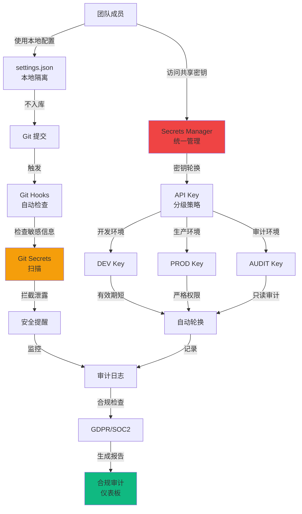
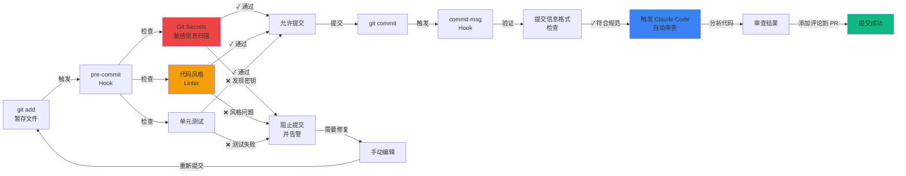
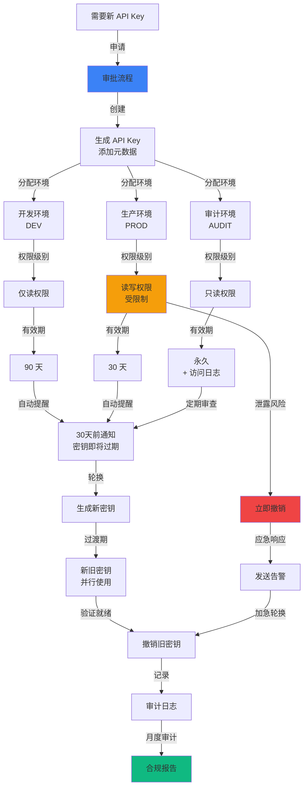

# 第八章：企业深水区——密钥安全、团队配置与合规审计全攻略

> API Key 泄露到 GitHub，5 分钟被扫描器抓到，一觉醒来账单 $15,000——这不是段子，是真实发生的安全事故。本章带你从团队配置统一化到企业合规审计，彻底解决企业落地 Claude Code 的最后一公里。

---

## 目录

- [1. 术语速查表](#1-术语速查表)
- [2. 团队配置统一化](#2-团队配置统一化)
  - [2.1 为什么要统一配置](#21-为什么要统一配置)
  - [2.2 标准配置仓库结构](#22-标准配置仓库结构)
  - [2.3 配置统一五条原则](#23-配置统一五条原则)
  - [2.4 一键安装脚本](#24-一键安装脚本)
- [3. Git Hooks + Claude Code 深度集成](#3-git-hooks--claude-code-深度集成)
  - [3.1 为什么需要 Git Hooks](#31-为什么需要-git-hooks)
  - [3.2 Pre-commit Hook：提交前自动检查](#32-pre-commit-hook提交前自动检查)
  - [3.3 Commit-msg Hook：规范提交信息](#33-commit-msg-hook规范提交信息)
- [4. 团队知识库建设](#4-团队知识库建设)
  - [4.1 知识库系统架构](#41-知识库系统架构)
  - [4.2 团队编码标准 Skill](#42-团队编码标准-skill)
- [5. CI/CD 深度集成](#5-cicd-深度集成)
  - [5.1 GitHub Actions 完整配置](#51-github-actions-完整配置)
- [6. 团队监控与跨团队协作](#6-团队监控与跨团队协作)
  - [6.1 Claude 使用情况监控](#61-claude-使用情况监控)
  - [6.2 多团队共享配置](#62-多团队共享配置)
- [7. API Key 安全管理](#7-api-key-安全管理)
  - [7.1 泄露的灾难后果](#71-泄露的灾难后果)
  - [7.2 密钥分级管理](#72-密钥分级管理)
  - [7.3 密钥存储方案对比](#73-密钥存储方案对比)
  - [7.4 密钥轮换自动化](#74-密钥轮换自动化)
- [8. 敏感数据保护](#8-敏感数据保护)
  - [8.1 Git Secrets 扫描](#81-git-secrets-扫描)
  - [8.2 日志脱敏](#82-日志脱敏)
- [9. 企业合规要求](#9-企业合规要求)
  - [9.1 GDPR 合规](#91-gdpr-合规)
  - [9.2 SOC 2 合规](#92-soc-2-合规)
- [10. 安全审计与事故响应](#10-安全审计与事故响应)
  - [10.1 综合安全扫描清单](#101-综合安全扫描清单)
  - [10.2 API 泄露应急预案](#102-api-泄露应急预案)
- [11. 20 条安全黄金规则](#11-20-条安全黄金规则)
- [12. 故障排查](#12-故障排查)
- [13. 总结](#13-总结)
- [14. 参考资料](#14-参考资料)

---

## 本章安全架构总览



---

## 1. 术语速查表

凯神先把企业级关键术语拉出来，后面用到的时候直接对照：

| 术语 | 英文全称 | 通俗解释 |
|------|---------|---------|
| Secrets Manager | - | 密钥管理服务，安全存储 API Key 等敏感信息 |
| Vault | HashiCorp Vault | 企业级密钥管理工具，支持密钥轮换和访问审计 |
| Git Hooks | - | Git 的钩子脚本，在提交/推送前自动执行检查 |
| ADR | Architecture Decision Record | 架构决策记录，记录技术选型的原因和上下文 |
| GDPR | General Data Protection Regulation | 欧盟通用数据保护条例 |
| SOC 2 | Service Organization Control 2 | 服务组织控制审计标准 |
| 2FA | Two-Factor Authentication | 双因素认证，增强账户安全 |
| RPM | Requests Per Minute | 每分钟请求数，API 速率限制单位 |
| DPO | Data Protection Officer | 数据保护官，负责合规的角色 |
| Bandit | - | Python 安全代码扫描工具 |
| Trivy | - | 容器镜像安全扫描工具 |

---

## 2. 团队配置统一化

### 2.1 为什么要统一配置

凯神见过太多团队踩这个坑了：

| 问题 | 后果 | 发生概率 |
|------|------|---------|
| 每个人 `settings.json` 不同 | 代码风格混乱，PR 冲突 | 95% |
| API Key 直接写在配置文件 | 泄露到 Git 仓库 | 80% |
| 新人手动配置需要 2 小时 | 效率低下，容易出错 | 100% |
| 配置更新无法同步 | 部分成员用旧配置 | 70% |
| 没有版本控制 | 回滚困难 | 60% |

**统一配置能一次性解决以上所有问题。**

### 2.2 标准配置仓库结构

凯神推荐的团队配置仓库长这样：

```
team-claude-config/
├── README.md                    # 配置说明文档
├── .editorconfig                # EditorConfig 通用规则
├── .env.example                 # 环境变量模板（绝对不放真实密钥！）
├── install.sh                   # 一键安装脚本（Linux/macOS）
├── install.ps1                  # 一键安装脚本（Windows）
├── update.sh                    # 配置更新脚本
├── validate.sh                  # 配置验证脚本
├── vscode/                      # VS Code 配置
│   ├── settings.json
│   ├── keybindings.json
│   ├── extensions.json          # 推荐扩展列表
│   └── snippets/
│       ├── python.json
│       └── javascript.json
├── cursor/                      # Cursor 配置
│   ├── settings.json
│   └── keybindings.json
├── claude/                      # Claude Code 专用配置
│   ├── system-prompts/          # 系统提示词
│   │   ├── code-review.md
│   │   ├── refactor.md
│   │   └── testing.md
│   ├── skills/                  # 团队技能包
│   │   └── team-standards/
│   │       ├── SKILL.md
│   │       └── prompts/
│   └── hooks/                   # Git hooks 模板
│       ├── pre-commit
│       ├── pre-push
│       └── commit-msg
├── ci/                          # CI/CD 配置
│   ├── github-actions/
│   │   ├── claude-review.yml
│   │   └── quality-check.yml
│   └── gitlab-ci/
│       └── .gitlab-ci.yml
├── docs/                        # 文档目录
│   ├── onboarding.md            # 新人上手指南
│   ├── troubleshooting.md
│   └── best-practices.md
├── scripts/                     # 工具脚本
│   ├── sync-config.sh
│   ├── check-updates.sh
│   └── backup-config.sh
└── tests/                       # 配置测试
    └── test_config.py
```

### 2.3 配置统一五条原则

| # | 原则 | 要求 |
|---|------|------|
| 1 | **Single Source of Truth** | 所有配置在 Git 仓库，本地配置 = 仓库的符号链接 |
| 2 | **Environment Variables First** | 敏感信息（API Key）**必须**用环境变量，绝对路径也用环境变量替换 |
| 3 | **Platform Agnostic** | 脚本支持 Windows/Linux/macOS，路径用相对路径 |
| 4 | **Automated Validation** | 每次更新自动验证配置正确性，CI 流水线中运行验证测试 |
| 5 | **Rollback Support** | 用 Git tag 标记稳定版本，提供一键回滚脚本 |

### 2.4 一键安装脚本

核心安装脚本结构（`install.sh`）：

```bash
#!/bin/bash
# install.sh - 团队 Claude 配置一键安装脚本
set -e

# ==================== 颜色定义 ====================
RED='\033[0;31m'
GREEN='\033[0;32m'
YELLOW='\033[1;33m'
BLUE='\033[0;34m'
NC='\033[0m'

log_info()    { echo -e "${GREEN}[INFO]${NC} $1"; }
log_warn()    { echo -e "${YELLOW}[WARN]${NC} $1"; }
log_error()   { echo -e "${RED}[ERROR]${NC} $1"; }
log_success() { echo -e "${BLUE}[SUCCESS]${NC} $1"; }

# ==================== 检测操作系统 ====================
detect_os() {
    if [[ "$OSTYPE" == "linux-gnu"* ]]; then
        OS="linux"
    elif [[ "$OSTYPE" == "darwin"* ]]; then
        OS="macos"
    elif [[ "$OSTYPE" == "msys" || "$OSTYPE" == "cygwin" ]]; then
        OS="windows"
    else
        log_error "不支持的操作系统: $OSTYPE"
        exit 1
    fi
    log_info "检测到操作系统: $OS"
}

# ==================== 备份现有配置 ====================
backup_existing_config() {
    log_info "备份现有配置..."
    BACKUP_DIR="$HOME/.claude-config-backup-$(date +%Y%m%d-%H%M%S)"
    mkdir -p "$BACKUP_DIR"

    case "$OS" in
        linux)   VSCODE_DIR="$HOME/.config/Code/User" ;;
        macos)   VSCODE_DIR="$HOME/Library/Application Support/Code/User" ;;
        windows) VSCODE_DIR="$APPDATA/Code/User" ;;
    esac

    if [[ -d "$VSCODE_DIR" ]]; then
        cp -r "$VSCODE_DIR" "$BACKUP_DIR/vscode-user"
        log_info "VS Code 配置已备份到: $BACKUP_DIR/vscode-user"
    fi

    log_success "备份完成: $BACKUP_DIR"
}

# ==================== 主函数 ====================
main() {
    echo "================================================"
    echo "  团队 Claude 配置一键安装脚本"
    echo "================================================"
    detect_os
    backup_existing_config
    # ... 后续安装步骤（链接配置文件、安装 hooks 等）
    log_success "安装完成！请重启编辑器使配置生效。"
}

main
```

> 凯神提醒：完整脚本建议放在团队配置仓库里维护，这里展示核心结构。Windows 用户对应写 `install.ps1`。

---

## 3. Git Hooks + Claude Code 深度集成

**Git Hooks 工作流程**：



### 3.1 为什么需要 Git Hooks

| 问题 | 后果 | Git Hook 解决方案 |
|------|------|-----------------|
| 代码未格式化就提交 | PR 冲突，难以 review | `pre-commit` hook 自动格式化 |
| 提交信息混乱 | Git 历史难以追踪 | `commit-msg` hook 规范化 |
| 未运行测试就 push | 破坏主分支 | `pre-push` hook 强制测试 |
| 代码有明显 bug | 浪费 reviewer 时间 | Claude 自动代码审查 |
| 文档未更新 | 文档与代码不一致 | Claude 自动检测提醒 |

**Git Hooks + Claude Code = 自动化代码质量守门员。**

### 3.2 Pre-commit Hook：提交前自动检查

```bash
#!/bin/bash
# .git/hooks/pre-commit - 提交前检查脚本
# 集成 Claude Code 进行自动代码审查
set -e

# ==================== 获取暂存文件 ====================
get_staged_files() {
    git diff --cached --name-only --diff-filter=ACM
}

# ==================== Python 代码格式化 ====================
format_python() {
    echo "[INFO] 格式化 Python 代码..."
    PYTHON_FILES=$(get_staged_files | grep '\.py$' || true)
    if [[ -z "$PYTHON_FILES" ]]; then
        return 0
    fi

    # 使用 Black 格式化
    if command -v black &> /dev/null; then
        echo "$PYTHON_FILES" | xargs black --quiet
        echo "[INFO] Black 格式化完成"
    fi

    # 使用 Ruff 检查
    if command -v ruff &> /dev/null; then
        if ! echo "$PYTHON_FILES" | xargs ruff check; then
            echo "[ERROR] Ruff 检查失败，请修复错误后再提交"
            exit 1
        fi
    fi

    # 重新添加格式化后的文件
    echo "$PYTHON_FILES" | xargs git add
}

# ==================== Claude 代码审查 ====================
claude_code_review() {
    echo "[INFO] 运行 Claude Code 审查..."
    DIFF=$(git diff --cached)
    if [[ -z "$DIFF" ]]; then
        return 0
    fi

    # 调用 Claude API 进行代码审查
    REVIEW_RESULT=$(curl -s https://api.anthropic.com/v1/messages \
      -H "x-api-key: ${ANTHROPIC_API_KEY}" \
      -H "anthropic-version: 2023-06-01" \
      -H "content-type: application/json" \
      -d "{
        \"model\": \"claude-haiku-4-5-20251001\",
        \"max_tokens\": 2048,
        \"messages\": [{
          \"role\": \"user\",
          \"content\": \"请快速审查以下代码变更，仅报告严重问题。如果没有严重问题，回复'通过'。\\n\\n${DIFF}\"
        }]
      }" | jq -r '.content[0].text')

    # 检查是否有严重问题
    if echo "$REVIEW_RESULT" | grep -qi "严重\|critical\|security"; then
        echo "[ERROR] Claude 发现严重问题，提交被拒绝："
        echo "$REVIEW_RESULT"
        exit 1
    fi

    echo "[INFO] Claude 代码审查通过"
}

# ==================== 主函数 ====================
main() {
    echo "[INFO] 开始 pre-commit 检查..."
    format_python
    claude_code_review
    echo "[INFO] 所有检查通过，允许提交"
}

main
```

> 凯神建议：`pre-commit` 调用 Claude 审查时用 **Haiku 模型**（速度快、成本低），只拦截严重问题。详细审查交给 CI/CD 阶段的 Sonnet/Opus。

### 3.3 Commit-msg Hook：规范提交信息

```bash
#!/bin/bash
# .git/hooks/commit-msg - 提交信息规范化脚本

COMMIT_MSG_FILE=$1
COMMIT_MSG=$(cat "$COMMIT_MSG_FILE")

# Conventional Commits 规范检查
TYPES="feat|fix|docs|style|refactor|perf|test|chore|build|ci|revert"
if ! echo "$COMMIT_MSG" | grep -qE "^($TYPES)(\(.+\))?: .+"; then
    echo "[WARN] 提交信息不符合 Conventional Commits 规范"
    echo "[WARN] 格式：type(scope): description"
    echo "[WARN] 示例：feat(auth): 添加 OAuth 登录功能"

    # 可选：调用 Claude 自动生成
    if [[ -n "$ANTHROPIC_API_KEY" ]]; then
        DIFF=$(git diff --cached --stat)
        echo "[INFO] 正在用 Claude 生成规范提交信息..."
        # ... 调用 Claude API 生成 commit message
    fi

    exit 1
fi

echo "[INFO] 提交信息格式检查通过"
```

---

## 4. 团队知识库建设

### 4.1 知识库系统架构

把团队的编码标准、架构模式、最佳实践都沉淀到 Claude 可读的知识库里：

```
team-knowledge-base/
├── .claude/
│   ├── skills/
│   │   ├── team-standards/        # 团队编码标准
│   │   │   ├── SKILL.md
│   │   │   └── prompts/
│   │   │       ├── python-style.md
│   │   │       ├── javascript-style.md
│   │   │       └── api-design.md
│   │   ├── architecture/          # 架构模式
│   │   │   ├── SKILL.md
│   │   │   └── prompts/
│   │   │       ├── microservices.md
│   │   │       └── database-design.md
│   │   └── testing/               # 测试规范
│   │       ├── SKILL.md
│   │       └── prompts/
│   │           ├── unit-test.md
│   │           └── integration-test.md
│   └── memory/
│       ├── common-patterns.json   # 常见代码模式
│       ├── team-decisions.json    # 技术决策记录（ADR）
│       └── best-practices.json    # 最佳实践
├── docs/
│   ├── architecture/              # 架构文档
│   ├── api/                       # API 文档
│   └── guides/                    # 开发指南
└── README.md
```

### 4.2 团队编码标准 Skill

在 `SKILL.md` 里定义团队编码标准：

```markdown
---
name: team-standards
description: 团队编码标准和最佳实践
---

# 团队编码标准

## Python 代码规范
- 使用 Black 格式化，行宽 88
- 类型注解覆盖所有公开函数
- Docstring 使用 Google 风格
- 导入顺序：标准库 → 第三方 → 本地

## JavaScript/TypeScript 规范
- 使用 ESLint + Prettier
- 优先使用 TypeScript
- React 组件使用函数式 + Hooks
- API 调用统一使用 fetch wrapper

## API 设计规范
- RESTful 命名，资源用复数
- 统一错误响应格式 { code, message, data }
- 版本号放在 URL 路径中 /api/v1/
- 分页用 cursor-based pagination
```

> 凯神提醒：把这个 Skill 放在项目 `.claude/skills/` 下，Claude Code 写代码时就会自动遵守团队规范。新人入职第一天就能写出符合团队标准的代码。

---

## 5. CI/CD 深度集成

### 5.1 GitHub Actions 完整配置

第七章已经介绍了 `anthropics/claude-code-action@v1` 的基础用法，这里给一个更完整的企业级配置：

```yaml
# .github/workflows/claude-ci.yml
name: Claude Code CI

on:
  pull_request:
    branches: [main, develop]
  push:
    branches: [main, develop]

env:
  ANTHROPIC_API_KEY: ${{ secrets.ANTHROPIC_API_KEY }}

jobs:
  # ===== 代码审查 =====
  code-review:
    name: Claude 代码审查
    if: github.event_name == 'pull_request'
    runs-on: ubuntu-latest
    steps:
      - uses: actions/checkout@v4
        with:
          fetch-depth: 0

      - name: 获取变更文件
        id: changed-files
        uses: tj-actions/changed-files@v39

      - name: Claude 代码审查
        if: steps.changed-files.outputs.any_changed == 'true'
        run: |
          DIFF=$(git diff origin/${{ github.base_ref }}...HEAD)
          REVIEW=$(curl -s https://api.anthropic.com/v1/messages \
            -H "x-api-key: $ANTHROPIC_API_KEY" \
            -H "anthropic-version: 2023-06-01" \
            -H "content-type: application/json" \
            -d "{
              \"model\": \"claude-sonnet-4-6\",
              \"max_tokens\": 4096,
              \"messages\": [{
                \"role\": \"user\",
                \"content\": \"请审查以下 PR 的代码变更，按【必须修改】【建议修改】【优点】三部分输出。\\n\\n${DIFF}\"
              }]
            }" | jq -r '.content[0].text')

          echo "## Claude 代码审查结果" >> $GITHUB_STEP_SUMMARY
          echo "$REVIEW" >> $GITHUB_STEP_SUMMARY

  # ===== 代码质量检查 =====
  quality-check:
    name: 代码质量检查
    runs-on: ubuntu-latest
    steps:
      - uses: actions/checkout@v4
      - uses: actions/setup-python@v4
        with:
          python-version: '3.11'
      - run: pip install black ruff pytest pytest-cov
      - run: black --check .
      - run: ruff check .
      - run: pytest --cov --cov-report=xml

  # ===== 安全扫描 =====
  security-scan:
    name: 安全扫描
    if: github.event_name == 'pull_request'
    runs-on: ubuntu-latest
    steps:
      - uses: actions/checkout@v4

      - name: 扫描硬编码密钥
        run: |
          # 检查是否有 API Key 泄露
          if grep -rE "sk-ant-api[0-9]{2}-[a-zA-Z0-9_-]{20,}" --include="*.py" --include="*.js" --include="*.ts" .; then
            echo "::error::发现硬编码的 API Key！"
            exit 1
          fi

      - name: 依赖漏洞扫描
        run: |
          pip install safety
          safety check --full-report || true
```

---

## 6. 团队监控与跨团队协作

### 6.1 Claude 使用情况监控

跟踪团队成员的 Claude API 调用和成本，避免失控：

```python
#!/usr/bin/env python3
"""Claude 使用情况监控脚本"""

import sqlite3
from datetime import datetime, timedelta

# 模型定价（每 1M tokens）
MODEL_PRICING = {
    "claude-haiku-4-5-20251001":  {"input": 0.80,  "output": 4.00},
    "claude-sonnet-4-6":         {"input": 3.00,  "output": 15.00},
    "claude-opus-4-6":           {"input": 15.00, "output": 75.00},
}

def log_api_call(user, model, prompt_tokens, completion_tokens):
    """记录一次 API 调用"""
    pricing = MODEL_PRICING.get(model, MODEL_PRICING["claude-sonnet-4-6"])
    cost = (prompt_tokens * pricing["input"] + completion_tokens * pricing["output"]) / 1_000_000
    # 存储到 SQLite / 发送到监控平台
    print(f"[{user}] {model} | tokens: {prompt_tokens}+{completion_tokens} | cost: ${cost:.4f}")

def generate_weekly_report():
    """生成周度使用报告"""
    # 统计：总调用次数、总成本、按用户拆分、按模型拆分
    # 输出 Markdown 表格 → 发送到 Slack/飞书
    pass
```

> 凯神建议：用 Haiku 做日常编码辅助（成本最低），Sonnet 做代码审查，Opus 只在复杂架构设计时使用。严格按模型分级能省 60%+ 成本。

### 6.2 多团队共享配置

大公司多团队使用 Claude Code 时，用**配置继承**避免重复：

```
company-claude-config/           # 公司级配置（基础）
├── .editorconfig
├── claude/
│   └── skills/
│       └── company-standards/   # 公司编码标准（全员遵守）
│
team-frontend-config/            # 前端团队配置（继承 + 扩展）
├── 继承: company-claude-config
└── claude/
    └── skills/
        └── react-patterns/      # React 专用模式
│
team-backend-config/             # 后端团队配置（继承 + 扩展）
├── 继承: company-claude-config
└── claude/
    └── skills/
        └── api-patterns/        # API 专用模式
```

核心思路：公司级定「红线」（安全规范、代码风格底线），团队级加「特色」（技术栈相关的最佳实践）。

---

## 7. API Key 安全管理

**这是本章最重要的部分，凯神必须拿出来单独重点讲。**

**API Key 全生命周期管理流程**：



### 7.1 泄露的灾难后果

真实安全事故，每一个都是血的教训：

| 事故 | 后果 | 损失 |
|------|------|------|
| API Key 提交到 GitHub 公开仓库 | 被扫描器 5 分钟内发现并盗刷 | **$15,000** |
| 硬编码在前端代码里 | 暴露给所有用户 | 无限额度滥用 |
| 明文存储在配置文件 | 服务器被入侵后泄露 | **$8,000** |
| 共享给离职员工未回收 | 前员工恶意使用 | 法律诉讼 |
| 未设置使用限制 | 被 DDoS 攻击刷量 | **$25,000** |

> 凯神说句掏心窝的话：以上每一条都是真实发生过的。一次泄露可能让你公司赔到肉疼。

### 7.2 密钥分级管理

企业必须按环境分级管理密钥：

```
Production Keys (生产环境)
├── Master Key (主密钥)          # 最高权限，仅 CEO/CTO 持有
│   ├── 用途：密钥轮换、紧急恢复
│   └── 访问：2FA + 硬件密钥
├── Service Keys (服务密钥)      # 各服务独立密钥
│   ├── API Gateway Key          # 限制：10,000 RPM
│   ├── Backend Service Key      # 限制：5,000 RPM
│   └── Batch Job Key            # 限制：100 RPM
└── Developer Keys (开发密钥)    # 开发/测试环境
    ├── Dev Environment          # 限制：100 RPM
    └── Test Environment         # 限制：50 RPM

Staging Keys (预发布环境)
└── 独立密钥，与生产完全隔离

Development Keys (开发环境)
└── 团队共享，每周轮换
```

### 7.3 密钥存储方案对比

**绝对禁止的做法（凯神看到就想打人）：**

```python
# ❌ 硬编码（等着被扫描器抓）
ANTHROPIC_API_KEY = "sk-ant-api03-XXXXXXXX"

# ❌ 提交到 Git（.env 未加入 .gitignore）
# ❌ 明文配置文件
api_key: "sk-ant-api03-XXXXXXXX"

# ❌ 写在前端代码里（暴露给全世界）
const API_KEY = "sk-ant-api03-XXXXXXXX";
```

**正确的企业级做法：**

```python
# ✅ 方案 1：AWS Secrets Manager
import boto3

def get_api_key() -> str:
    """从 AWS Secrets Manager 获取 API Key"""
    client = boto3.client('secretsmanager', region_name='us-east-1')
    response = client.get_secret_value(SecretId='prod/anthropic/api-key')
    return response['SecretString']

# ✅ 方案 2：HashiCorp Vault
import hvac, os

def get_api_key_from_vault() -> str:
    """从 Vault 获取 API Key"""
    client = hvac.Client(url='https://vault.example.com:8200')
    client.auth.approle.login(
        role_id=os.getenv("VAULT_ROLE_ID"),
        secret_id=os.getenv("VAULT_SECRET_ID")
    )
    secret = client.secrets.kv.v2.read_secret_version(
        path='anthropic/api-key',
        mount_point='secret'
    )
    return secret['data']['data']['key']
```

三大方案对比：

| 方案 | 优点 | 缺点 | 适用场景 |
|------|------|------|---------|
| AWS Secrets Manager | 与 AWS 生态深度集成 | 仅限 AWS | AWS 用户 |
| HashiCorp Vault | 跨平台、功能强大 | 需要额外部署维护 | 多云环境 |
| Azure Key Vault | 与 Azure 集成良好 | 仅限 Azure | Azure 用户 |

> 凯神建议：中小团队用环境变量 + `.env`（确保加入 `.gitignore`）就够了；中大型企业必须上 Secrets Manager 或 Vault。

### 7.4 密钥轮换自动化

密钥不是配一次就完事了，必须定期轮换：

```
检查密钥过期（90 天周期）
         ↓
  生成新密钥
         ↓
  存储到 Vault（备份旧密钥）
         ↓
  更新所有服务（滚动更新）
         ↓
  等待 5 分钟观察
         ↓
     验证新密钥
    ↙         ↘
成功             失败
 ↓                ↓
撤销旧密钥      回滚到旧密钥
通知成功        告警通知
```

| 项目 | 建议值 |
|------|-------|
| 轮换周期 | 生产密钥 90 天，开发密钥 30 天 |
| 回滚窗口 | 旧密钥保留 24 小时后撤销 |
| 通知渠道 | Slack/飞书 + 邮件 |
| 审计日志 | 记录每次轮换操作的时间、操作人、结果 |

---

## 8. 敏感数据保护

### 8.1 Git Secrets 扫描

在 `pre-commit` 里加上敏感信息正则扫描，防止密钥意外提交：

```bash
#!/bin/bash
# 敏感信息扫描 - 集成到 pre-commit hook

# 定义敏感信息正则表达式
declare -A PATTERNS=(
    ["anthropic_api_key"]='sk-ant-api[0-9]{2}-[a-zA-Z0-9_-]{20,}'
    ["aws_access_key"]='AKIA[0-9A-Z]{16}'
    ["aws_secret_key"]='[0-9a-zA-Z/+=]{40}'
    ["openai_api_key"]='sk-[a-zA-Z0-9]{48}'
    ["github_token"]='ghp_[a-zA-Z0-9]{36}'
    ["private_key"]='-----BEGIN (RSA |EC |OPENSSH )?PRIVATE KEY-----'
    ["password_assignment"]='password\s*[=:]\s*['"'"'"][^'"'"'"]{8,}['"'"'"]'
)

STAGED_FILES=$(git diff --cached --name-only)
FOUND_SECRETS=0

for file in $STAGED_FILES; do
    for pattern_name in "${!PATTERNS[@]}"; do
        if grep -qE "${PATTERNS[$pattern_name]}" "$file" 2>/dev/null; then
            echo "[ERROR] 在 $file 中发现疑似 $pattern_name"
            FOUND_SECRETS=1
        fi
    done
done

if [[ $FOUND_SECRETS -eq 1 ]]; then
    echo "[ERROR] 发现敏感信息！提交被拒绝。"
    echo "[ERROR] 请将敏感信息移至环境变量或 Secrets Manager。"
    exit 1
fi
```

### 8.2 日志脱敏

生产环境日志必须自动脱敏，防止敏感信息泄露到日志系统：

```python
import re
import logging

class SensitiveDataFilter(logging.Filter):
    """日志脱敏过滤器"""

    PATTERNS = {
        "api_key":     (r'sk-ant-api\d{2}-\S{10,}', 'sk-ant-api**-*****'),
        "email":       (r'[\w.-]+@[\w.-]+\.\w+', '***@***.***'),
        "phone":       (r'\d{3}-\d{3,4}-\d{4}', '***-****-****'),
        "credit_card": (r'\d{4}[\s-]?\d{4}[\s-]?\d{4}[\s-]?\d{4}', '**** **** **** ****'),
    }

    def filter(self, record):
        msg = str(record.msg)
        for name, (pattern, replacement) in self.PATTERNS.items():
            msg = re.sub(pattern, replacement, msg)
        record.msg = msg
        return True

# 使用方式
logger = logging.getLogger()
logger.addFilter(SensitiveDataFilter())
```

---

## 9. 企业合规要求

### 9.1 GDPR 合规

如果你的业务涉及欧盟用户，必须满足 GDPR：

| 要求 | 说明 | Claude Code 实现 |
|------|------|-----------------|
| 数据最小化 | 仅收集必要数据 | 限制日志记录的个人信息 |
| 访问权 | 用户可请求访问其数据 | 提供数据导出 API |
| 删除权 | 用户可请求删除数据 | 实现数据删除流程 |
| 数据可移植性 | 数据可导出 | 支持 JSON/CSV 格式导出 |
| 违规通知 | 72 小时内通知 | 自动化事故响应流程 |
| 数据保护官 | 指定 DPO | 安全团队负责人 |

### 9.2 SOC 2 合规

SOC 2 审计关注五大信任原则：

| 原则 | 含义 | 关键措施 |
|------|------|---------|
| 安全性（Security） | 防止未授权访问 | API Key 分级、2FA、最小权限 |
| 可用性（Availability） | 系统正常运行 | 监控告警、故障切换、SLA |
| 处理完整性（Processing Integrity） | 数据处理正确 | 审计日志、数据校验 |
| 机密性（Confidentiality） | 敏感信息保密 | 加密传输、日志脱敏、密钥管理 |
| 隐私性（Privacy） | 个人信息保护 | GDPR 合规、数据生命周期管理 |

---

## 10. 安全审计与事故响应

### 10.1 综合安全扫描清单

定期执行以下安全扫描：

| # | 扫描项 | 工具 | 频率 |
|---|--------|------|------|
| 1 | Git Secrets 扫描 | git-secrets / pre-commit hook | 每次提交 |
| 2 | 依赖漏洞扫描 | Safety（Python）/ npm audit（Node） | 每次 CI |
| 3 | 代码安全扫描 | Bandit（Python）/ ESLint security | 每次 CI |
| 4 | 容器镜像扫描 | Trivy | 每次构建 |
| 5 | 配置文件安全检查 | 自定义脚本（检查 .env 权限等） | 每日 |
| 6 | SSL/TLS 检查 | testssl.sh | 每周 |
| 7 | 密钥轮换检查 | 自动化脚本 | 每月 |

### 10.2 API 泄露应急预案

**发现 API Key 泄露后的分钟级响应流程：**

```
API Key 泄露检测
         ↓
  [自动告警] → Slack / 飞书 / 邮件 / 短信
         ↓
  ┌─── 立即响应（5 分钟内）───┐
  │ 1. 撤销泄露的密钥          │
  │ 2. 生成新密钥              │
  │ 3. 更新所有受影响服务      │
  │ 4. 通知相关人员            │
  └────────────────────────────┘
         ↓
  ┌─── 调查分析（1 小时内）───┐
  │ 5. 分析泄露原因            │
  │ 6. 评估影响范围            │
  │ 7. 检查异常 API 使用       │
  │ 8. 记录审计日志            │
  └────────────────────────────┘
         ↓
  ┌─── 修复加固（24 小时内）──┐
  │ 9. 修复泄露源             │
  │ 10. 加强访问控制          │
  │ 11. 更新安全策略          │
  │ 12. 培训相关人员          │
  └───────────────────────────┘
         ↓
  ┌─── 复盘总结（72 小时内）──┐
  │ 13. 编写事故报告           │
  │ 14. 改进响应流程           │
  │ 15. 预防类似事故           │
  └────────────────────────────┘
```

> 凯神提醒：Anthropic Console 后台可以即时撤销密钥。发现泄露的第一秒就去撤销，不要犹豫。

---

## 11. 20 条安全黄金规则

凯神把企业安全浓缩成 20 条规则，按优先级排列，P0 是必须立即执行的：

| # | 规则 | 检查方法 | 优先级 |
|---|------|---------|--------|
| 1 | API Key **永远不硬编码** | Git Secrets 扫描 | **P0** |
| 2 | 使用环境变量或 Secrets Manager | 代码审查 | **P0** |
| 3 | 每 90 天轮换一次密钥 | 自动化脚本 | **P0** |
| 4 | 限制 API 速率 | 配置检查 | **P0** |
| 5 | 记录所有 API 访问 | 审计日志 | **P0** |
| 6 | 异常访问立即告警 | 监控系统 | **P0** |
| 7 | 敏感数据必须加密 | 数据审计 | P1 |
| 8 | 日志自动脱敏 | 日志检查 | P1 |
| 9 | 定期安全扫描 | CI/CD 集成 | P1 |
| 10 | 依赖漏洞检查 | Safety / npm audit | P1 |
| 11 | 最小权限原则 | 权限审计 | P1 |
| 12 | 多因素认证（2FA） | 用户账户检查 | P1 |
| 13 | 网络隔离 | 网络配置 | P2 |
| 14 | SSL/TLS 加密 | SSL 检查 | P2 |
| 15 | 防火墙配置 | 网络安全审计 | P2 |
| 16 | 备份与恢复 | 备份测试 | P2 |
| 17 | 安全培训 | 团队培训记录 | P2 |
| 18 | 事故响应预案 | 演练测试 | P2 |
| 19 | 合规性审计 | 定期审计 | P3 |
| 20 | 安全文档更新 | 文档检查 | P3 |

> 凯神建议：先把 P0 的 6 条全部落地，再逐步推进 P1 和 P2。P0 没做好就上生产，等于裸奔。

---

## 12. 故障排查

| 问题 | 可能原因 | 解决方案 |
|------|---------|---------|
| 团队成员配置不一致 | 没用统一配置仓库，手动配置 | 建立配置仓库 + `install.sh` 一键安装 |
| `pre-commit` hook 没生效 | hook 文件没有执行权限 | `chmod +x .git/hooks/pre-commit` |
| Claude 代码审查调用失败 | API Key 未设置或过期 | 检查 `ANTHROPIC_API_KEY` 环境变量 |
| CI 安全扫描误报 | 正则匹配到测试数据 | 在扫描脚本中排除 `tests/` 目录 |
| 密钥轮换后服务中断 | 新密钥未正确分发到所有服务 | 使用滚动更新 + 健康检查验证 |
| 审计日志丢失 | 日志存储空间不足 | 配置日志轮转 + 归档到对象存储 |
| Secrets Manager 连接失败 | IAM 权限不足或网络不通 | 检查 IAM Policy 和 VPC 网络配置 |
| Git Secrets 扫描太慢 | 仓库文件太多 | 只扫描暂存文件（`--cached`），排除二进制文件 |

---

## 13. 总结

本章凯神带你走了一遍企业落地 Claude Code 的「深水区」：

**团队协作侧：**

| 主题 | 核心要点 |
|------|---------|
| 团队配置统一化 | 配置仓库 + 一键安装 + 自动验证 + 版本回滚 |
| Git Hooks 深度集成 | pre-commit 自动格式化 + Claude 审查 + commit-msg 规范化 |
| 团队知识库 | Skills 沉淀编码标准 + ADR 记录技术决策 |
| CI/CD 深度集成 | GitHub Actions + Claude API 自动审查 + 安全扫描 |
| 监控与跨团队协作 | 使用量追踪 + 成本控制 + 配置继承 |

**安全合规侧：**

| 主题 | 核心要点 |
|------|---------|
| API Key 安全 | 分级管理 + Secrets Manager/Vault + 90 天轮换 |
| 敏感数据保护 | Git Secrets 扫描 + 日志脱敏 |
| 企业合规 | GDPR 六大要求 + SOC 2 五大原则 |
| 安全审计 | 7 项定期扫描 + API 泄露应急预案 |
| 安全规则 | 20 条黄金规则，P0 必须立即执行 |

**记住凯神这三条铁律：**

1. **Never trust, always verify** —— 零信任原则
2. **Defense in depth** —— 纵深防御
3. **Fail securely** —— 安全失败

---

## 14. 参考资料

- [Claude Code 官方文档](https://docs.anthropic.com/zh-CN/docs/claude-code)
- [Anthropic Console - API Key 管理](https://console.anthropic.com/)
- [OWASP Top 10 安全风险](https://owasp.org/www-project-top-ten/)
- [Conventional Commits 规范](https://www.conventionalcommits.org/zh-hans/)
- [HashiCorp Vault 官方文档](https://developer.hashicorp.com/vault/docs)
- [AWS Secrets Manager 文档](https://docs.aws.amazon.com/secretsmanager/)
